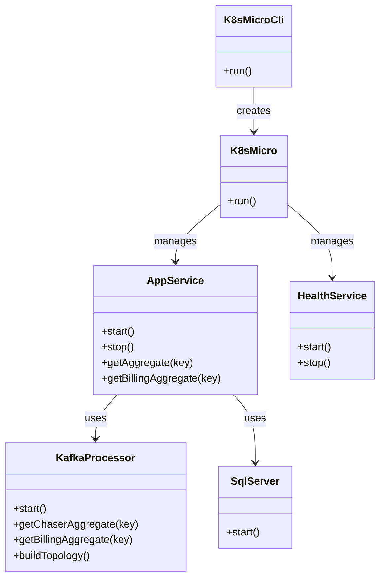
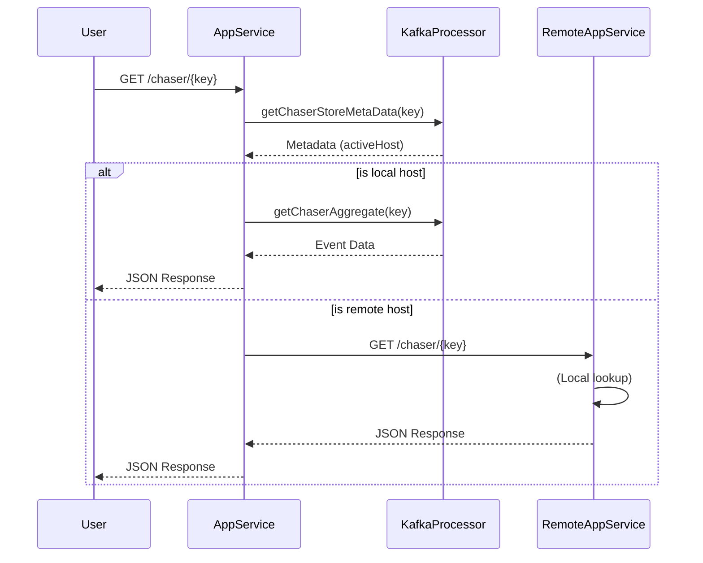

# k8s-micro

Create a tiny kotlin service to create IoT messages via kafka and process them calculcate on the fly data.
This service needs to be small to allow it to be run on edge nodes which are typically
small with minimal memory and CPU footprint.

Target System footprint for edge nodes: 200M image and 200M memory.

https://github.com/papsign/Ktor-OpenAPI-Generator

This is a small container and helm chart to provide a basic microservice with trimmings.

The objective is to provide:
* [x] Fast incremental build (IDE and docker)
* [x] CLI arguments
* [x] Config loading
* [x] Health services (Alive and Ready)
* [x] Startup hook
* [x] Shutdown hook
* [x] Logging
* [x] Monitoring (https://ktor.io/docs/micrometer-metrics.html#prometheus_endpoint)
* [x] Extensible Monitoring (customer monitoring objects)
* [x] Basic Monitoring (http system, JVM)
* [x] OpenAPI (https://ktor.io/docs/openapi.html)
* [x] git good practices (pre-commit, etc)
* [x] Modern JDK11
* [x] JDK25
* [x] Coroutines
* [ ] KTOR development mode (https://ktor.io/docs/auto-reload.html#watch-paths)
* [x] License
* [ ] Useful README
  * [x] README describing dev process and reloads, etc
* [ ] Review items
  * [x] Use of threads + coroutines
  * [x] Structure of code/modules - Health separation from functional code
* [ ] Multiarch Docker images
* [ ] Capture pod id into service configs
* [ ] Print routes on startup: https://github.com/ktorio/ktor/issues/1252#issuecomment-551304202
* [ ] Avro and Kafka : https://stefano-zanella.medium.com/publishing-avro-records-to-kafka-with-kotlin-avro4k-and-spring-boot-ba6be23bcba2
* [ ] Useful reference for kafka and Avro4k : https://github.com/thake/avro4k-kafka-serializer/blob/main/src/main/kotlin/com/github/thake/kafka/avro4k/serializer/AbstractKafkaAvro4kSerDe.kt
* [ ] PreProcessor for Hoplite to read K8s Secrets from files
*

# Software Architecture

The `k8s-micro` service is designed as a modular Kotlin application running on the JVM. It leverages Ktor for HTTP services and Kafka Streams for real-time event processing.

## High-Level Components

*   **K8sMicroCli**: The entry point, handling command-line arguments and configuration loading.
*   **K8sMicro**: The main application orchestrator, managing the lifecycle of the AppService and HealthService.
*   **AppService**: The core business logic service. It runs a Ktor web server for API requests and manages the `KafkaProcessor`.
*   **HealthService**: A dedicated service running on a separate port (8079) for health checks (liveness, readiness) and metrics.
*   **KafkaProcessor**: Handles Kafka Streams topology, aggregating events from input topics and writing to output topics. It maintains local state stores for `chaser` and `billing` aggregates.

## Class Diagram



## Data Flow: Aggregate Retrieval

When a request for an aggregate (e.g., `/chaser/{key}`) is received:
1.  **AppService** checks the local **KafkaProcessor** for metadata about the key.
2.  If the key is hosted locally, it retrieves the data from the local state store.
3.  If the key is hosted on another instance (determined by Kafka Streams metadata), it forwards the HTTP request to that instance.



# API Documentation

The service exposes endpoints on two ports: the main application port (configured via `config.webserver.port`, default likely 8080) and the health port (8079).

## Application API (Port 8080)

| Method | Path | Description |
| :--- | :--- | :--- |
| `GET` | `/` | Returns `{ "str": "params.a" }` |
| `GET` | `/hello` | Returns `"Hello back"` |
| `GET` | `/string/{a}` | Returns `"Smoke{a}"` |
| `GET` | `/count` | Increments and returns a counter. |
| `GET` | `/chaser/{key}` | Retrieves the Chaser aggregate for the given key. Forwards if necessary. |
| `GET` | `/chaser` | Lists all keys in the local Chaser aggregate store. |
| `GET` | `/billing/{key}` | Retrieves the Billing aggregate for the given key. Forwards if necessary. |
| `GET` | `/billing` | Lists all keys in the local Billing aggregate store. |

## Health API (Port 8079)

| Method | Path | Description |
| :--- | :--- | :--- |
| `GET` | `/hams/version` | Returns the application version. |
| `GET` | `/hams/startup` | Simple probe to confirm the service is running. |
| `GET` | `/hams/stop` | Initiates application shutdown. |
| `GET` | `/hams/metrics` | Returns Prometheus metrics. |
| `GET` | `/hams/ready` | Readiness check. Returns 200 OK if ready, 429 otherwise. |
| `GET` | `/hams/alive` | Liveness check. Returns 200 OK if alive, 406 otherwise. |

# Development HowTo

## Prerequisites

*   JDK 25 (Eclipse Temurin recommended)
*   Docker
*   Maven
*   `make`

## Building and Running Locally

1.  **Start Infrastructure**:
    You need Kafka and Schema Registry running. The `Makefile` provides commands assuming a local Confluent Platform installation, but you might need to adjust paths.
    ```bash
    make start-zookeeper
    make start-kafka
    make start-schema
    ```
    Alternatively, use a docker-compose setup if available (not currently in repo).

2.  **Build the Project**:
    ```bash
    make verify
    make package
    ```

3.  **Run the Application**:
    ```bash
    make run
    ```
    This runs the jar with default arguments.

4.  **Run with Docker**:
    To build the Docker image:
    ```bash
    make docker-build
    ```
    To run the Docker container:
    ```bash
    make docker-run
    ```

## Creating Topics

Use the helper commands to create necessary Kafka topics:
```bash
make topics-create
```

# Anomalies / Technical Debt

During the code review, the following items were identified:

1.  **Unused Code**:
    *   `KafkaProcessor.writeMe`: This function appears to be a placeholder or leftover test code.
    *   `SqlServer`: Instantiated in `AppService` but the start coroutine is commented out (`// launch { sqlServer.start() }`).

2.  **Commented-out Code**:
    *   `AppRouting.kt`: Contains commented-out examples of `@Path` and `@Response` annotations.
    *   `HealthRouting.kt`: Contains commented-out code `// call.respond(health)`.

3.  **Potential Logic Issues**:
    *   `AppService.getAggregate`: Has a TODO comment "THis is not tested" regarding the forwarding logic. The forwarding logic manually constructs a URL which might be brittle.
    *   `KafkaProcessor.buildTopology`: The aggregation logic involves unchecked casts (`as Event.BillAggregate`, `as Event`) and manual type checking which can be error-prone if the schema evolves.
    *   The `/` route in `AppRouting` returns a static map `{ "str": "params.a" }` which seems like a copy-paste error or placeholder.

4.  **Hardcoded Values**:
    *   `HealthService` port is defaulted to `8079`.
    *   `KafkaProcessorConfig` has default values for topics and servers which might need to be fully externalized.

# Approach

## Multiarch images

Create multiarch images amd64 and arm64 with Docker
Prepare by installing qemu. Then add support to docker buildx to use qemu.
Once the images are build they need to be loaded from buildx to docker itself. Load is currently broken for multiarch so needs to be done per image https://github.com/docker/buildx/issues/59
Once the images are published as platform specific images we can then publish a manifest with the multiarch image.

	  sudo apt-get install qemu binfmt-support qemu-user-static
    docker run --rm --privileged multiarch/qemu-user-static --reset -p yes
    docker buildx create --name mybuildercontext --use

This link https://github.com/docker/cli/issues/3350 possibly indicates that it may be possible to create the multiarch images locally and push as a single image.
BUT on confirmation this does not work as it is required for the images to be pushed to a repository.

    docker push {IMAGE_NAME}:${VERSION}-amd64
    docker push {IMAGE_NAME}:${VERSION}-arm64
    docker manifest create ${IMAGE_NAME}:${VERSION} ${IMAGE_NAME}:${VERSION}-arm64 ${IMAGE_NAME}:${VERSION}-amd64


# Dependencies

This repo uses the following dependencies:
[](https://github.com/pre-commit/pre-commit)
[](https://kotlinlang.org)
[](https://prometheus.io)
[](https://www.docker.com)
[](https://openjdk.org)
[](https://maven.apache.org)
[](https://github.com)

* JDK25: eclipse-temurin:25
* KTOR
* Hoplite
* Clikt

# Create k8s secrets

kubectl create secret generic k8s-micro --from-literal=username=user0 --from-literal=password=pass0

## GitHub Status


